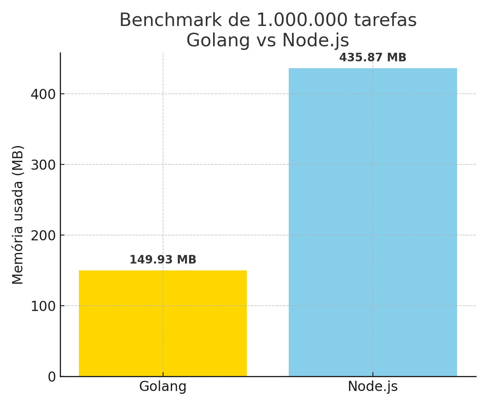

# Benchmark: Concorrência em Golang vs Node.js

Este repositório compara o consumo de memória entre **Golang** e **Node.js** ao executar **1.000.000 de tarefas concorrentes**.

## 🔍 Cenário

- As tarefas são simples (como `sleep` ou `promise`)
- Medição feita com `runtime.MemStats` no Go e `process.memoryUsage().heapUsed` no Node.js

## 📊 Resultado

| Linguagem | Tarefas   | Memória usada |
| --------- | --------- | ------------- |
| Golang    | 1.000.000 | 149.93 MB     |
| Node.js   | 1.000.000 | 435.87 MB     |

## 📈 Gráfico

## 💡 Conclusão

O **Golang** demonstrou um uso de memória significativamente menor, graças às suas **goroutines** leves (~2 KB cada), enquanto o Node.js, mesmo com seu modelo assíncrono baseado em `Promises`, apresentou um uso 3x maior de memória para a mesma carga concorrente.

---

Teste você mesmo! Clone este repositório, execute os benchmarks e analise com suas métricas reais.
